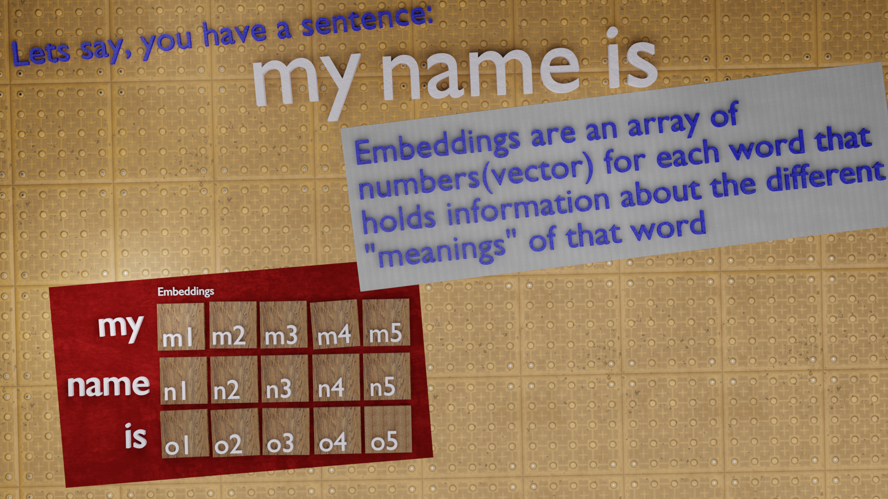
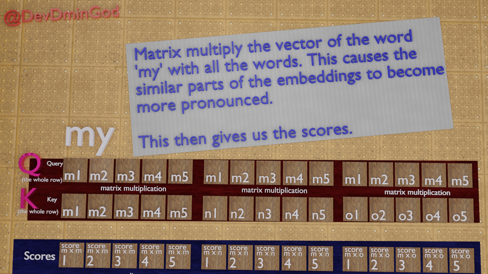
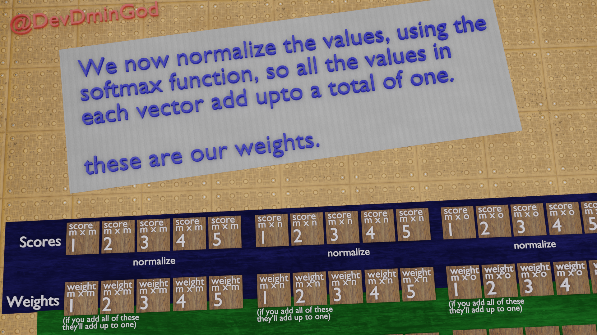
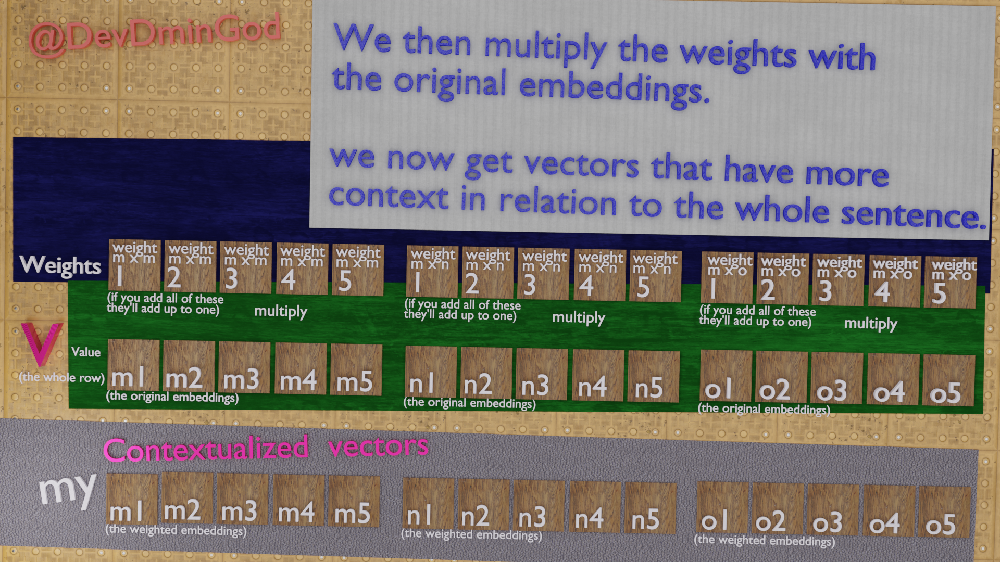
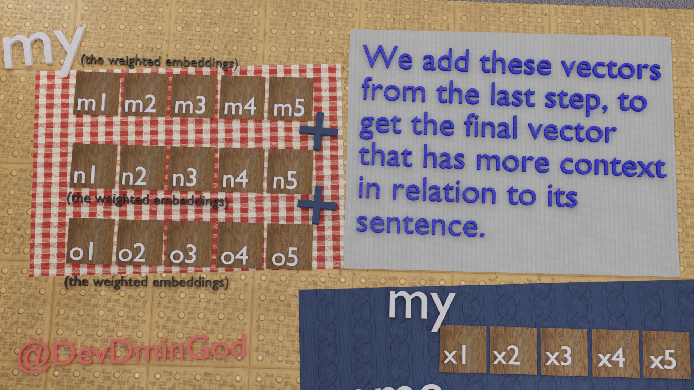
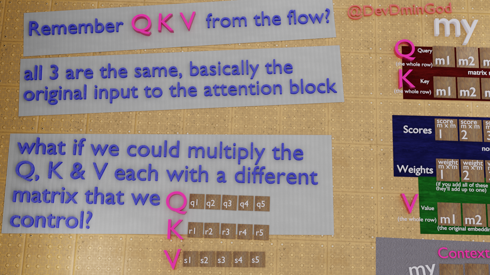
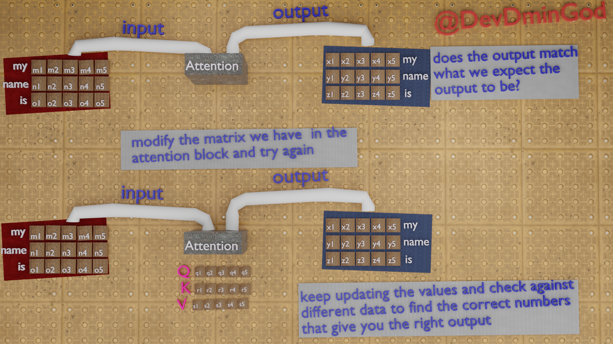
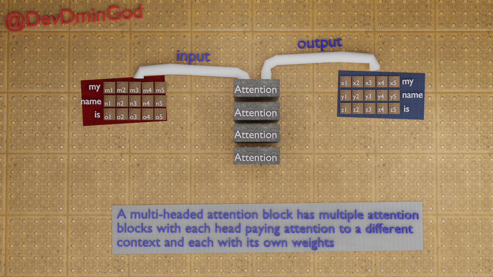

### What is this?
Given are a series of images that explain the Attention mechanism that is part of transformer models. This is not perfect (that's why its in a repo). I'd love feed back on this, additions to this are welcome as well.

If you are interested you can raise a request and I'll upload the blender files here too.

### Images

- 1

- 2

- 3

- 4

- 5

- 6

- 7

- 8

- 9

- 10

